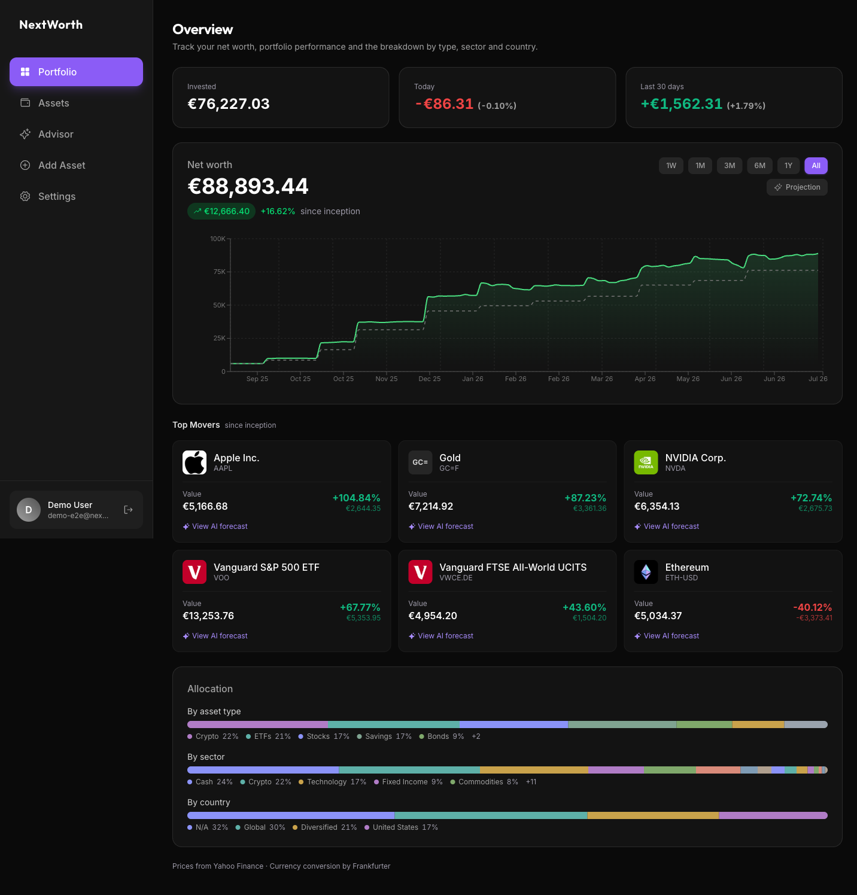
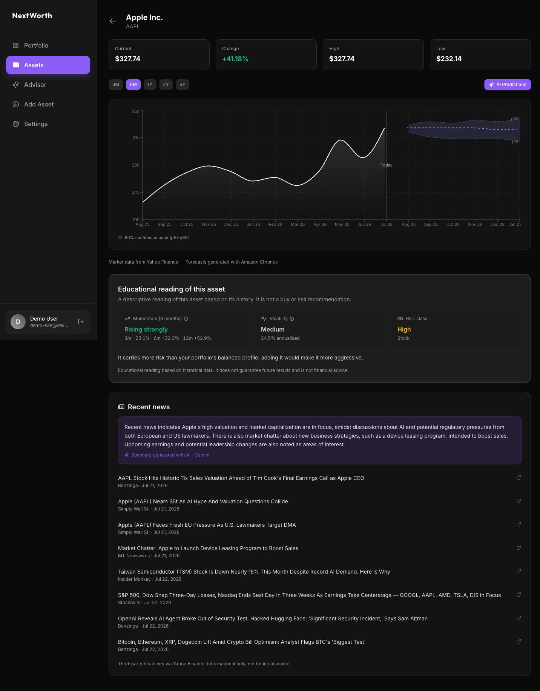
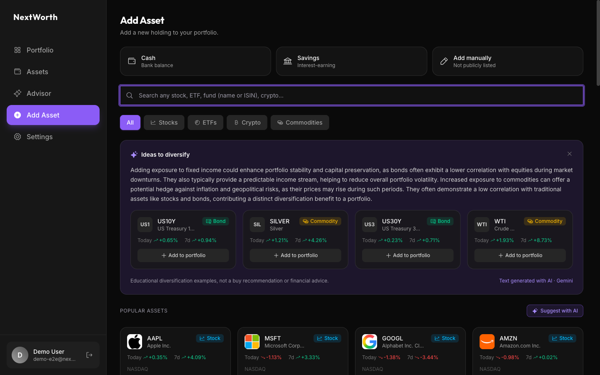
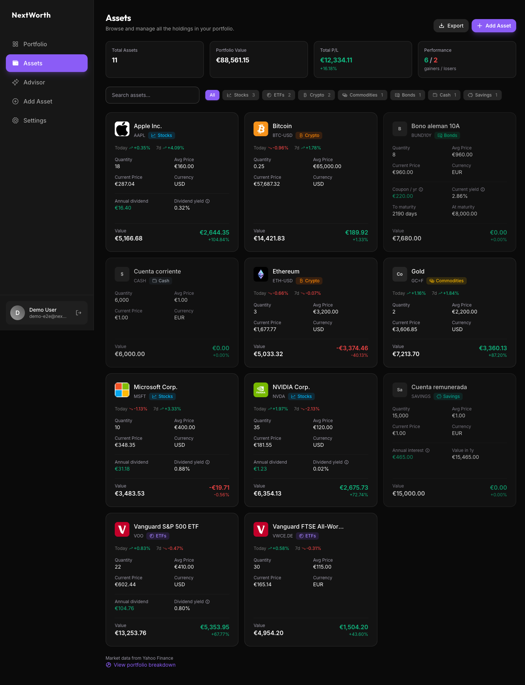

# NextWorth

Full-stack portfolio management app with AI-powered price predictions using Amazon Chronos, a foundation model for time-series forecasting.

**Try it live:** [next-worth-livid.vercel.app](https://next-worth-livid.vercel.app)

> The app is currently in **beta**. Create an account, add assets to your portfolio, and explore AI predictions — no credit card required.

## Screenshots

| Portfolio overview | Asset detail with AI forecast |
| :---: | :---: |
|  |  |
| **Add asset with AI diversification suggestions** | **Asset list with per-category color and variation** |
|  |  |

## What it does

NextWorth lets you track a multi-asset portfolio (stocks, ETFs, crypto, commodities, bonds, cash, savings) with real-time prices, multi-currency conversion, and profit/loss calculations. The key differentiator is the integrated ML service that generates price forecasts directly in the app.

### AI Predictions (Amazon Chronos)

The app includes a dedicated machine learning microservice built on [Amazon Chronos T5-Small](https://huggingface.co/amazon/chronos-t5-small), a pretrained probabilistic time-series foundation model developed by Amazon Science.

**How it works:**

1. When a user requests predictions for an asset, the backend fetches 2-5 years of monthly historical prices from Yahoo Finance
2. The historical close prices are sent to the ML service as a 1D tensor context
3. Chronos generates 10 sample forecast trajectories using its transformer-based architecture
4. The median of those trajectories becomes the predicted price for each future month
5. Results are cached in PostgreSQL with TTL to avoid redundant inference

**Model details:**

- **Model:** `amazon/chronos-t5-small` (20M parameters, T5 encoder-decoder)
- **Approach:** Zero-shot forecasting — no fine-tuning needed per asset. The model was pretrained on a large corpus of public time-series data and generates probabilistic forecasts for any unseen series
- **Horizons:** 3 months, 6 months, 1 year, 2 years, 5 years
- **Inference:** ~3-5 seconds per prediction on CPU, ~30s cold start (model load)
- **Output:** Median predicted close prices with no negative values (floor at $0.01)

**3-tier caching strategy:**

```
Request → In-memory promise dedup → PostgreSQL cache (TTL) → Stale fallback
```

Concurrent requests for the same asset/horizon are deduplicated in memory. Fresh predictions are served from the DB cache. If the ML service is down, stale cached predictions are returned with a warning.

## Features

- **Dashboard** — Net worth, total P&L, allocation donut chart, top movers
- **Asset Management** — Add from catalog (100+ assets) or manually, search/filter, card & table views
- **Asset Detail** — Interactive price chart (6M/1Y/2Y/5Y), AI predictions overlay with horizon selector
- **Multi-Currency** — Portfolio displayed in USD, EUR, or GBP with live FX rates (Frankfurter API)
- **Bond Support** — Face value, coupon rate, frequency, maturity date, TAE tracking

## Tech Stack

| Layer | Technology |
|-------|-----------|
| Framework | Next.js 16 (App Router, RSC, Server Actions) |
| Language | TypeScript |
| Database | PostgreSQL 17 + Prisma 7 |
| Auth | BetterAuth (email + password) |
| UI | Tailwind CSS v4 + shadcn/ui + Recharts |
| Market Data | Yahoo Finance (yahoo-finance2) |
| FX Rates | Frankfurter API |
| ML Service | Python Flask + Amazon Chronos T5-Small |
| Containerization | Docker Compose |

## Architecture

```
Browser
  │
  ▼
Next.js App (Vercel)
  ├── Server Components → Prisma → PostgreSQL (Neon)
  ├── Server Actions → Portfolio CRUD, Settings
  └── API Routes → Market data, Predictions
                        │
                        ▼
                  ML Service (Railway)
                  Flask + Amazon Chronos
```

**Production deployment:**

| Service | Platform |
|---------|----------|
| Next.js app | Vercel |
| PostgreSQL | Neon |
| ML Service | Railway (Docker) |

**Local development:**

```
Next.js App (port 3000)
  ├── Server Components → Prisma → PostgreSQL (Docker, port 5436)
  ├── Server Actions → Portfolio CRUD, Settings
  └── API Routes → Market data, Predictions
                        │
                        ▼
                  ML Service (Docker, port 5001)
                  Flask + Amazon Chronos
```

## Getting Started

```bash
# 1. Install dependencies
pnpm install

# 2. Start PostgreSQL + ML service
docker compose up -d

# 3. Run database migrations
pnpm db:migrate --name init

# 4. Generate Prisma client
pnpm prisma generate

# 5. Start dev server
pnpm dev
```

Register at `/register` and start adding assets to your portfolio.

## Scripts

```bash
pnpm dev              # Start dev server
pnpm build            # Generate Prisma client + build
pnpm db:migrate       # Run Prisma migrations
pnpm db:seed          # Seed test data
pnpm db:studio        # Open Prisma Studio
pnpm db:reset         # Reset database
docker compose up -d  # Start PostgreSQL + ML service
```

## AI usage

NextWorth uses AI in two clearly separated ways: **inside the product** (features shipped to users) and **during development** (as an engineering assistant). Both are documented openly for transparency.

### AI in the product

| Use point | Provider / model | Purpose |
|-----------|------------------|---------|
| Price forecasting | Amazon Chronos (`chronos-t5-small`), self-hosted, zero-shot | Probabilistic time-series prediction with a p10–p90 confidence band |
| Advisor text, news summaries, diversification suggestions | Google Gemini (`gemini-2.5-flash`) | Neutral, educational text generation — never buy/sell recommendations |

All AI outputs are labeled in the UI, degrade gracefully to deterministic fallbacks when a provider is unavailable, and are explained in the in-app "Cómo funciona la IA y de dónde vienen los datos" settings card. See [docs/RESPONSIBLE-AI.md](docs/RESPONSIBLE-AI.md) for the full responsible-use policy (data privacy, limitations, degradation).

### AI in development

This project was built with AI coding assistants (Claude / Claude Code) used as a pair-programming tool. AI assistance was applied at the following levels:

- **Programming:** scaffolding components and server modules, refactoring, writing unit and end-to-end tests, and debugging. Every AI-generated change was reviewed, adjusted, and integrated by the author.
- **Design:** iterating on UI layout, component styling, and theming decisions (Tailwind + shadcn/ui), and reviewing visual consistency across views.
- **Documentation:** drafting and structuring parts of the technical docs.

The architecture, product decisions, data model, and final responsibility for the codebase are the author's. AI was a productivity tool, not an autonomous author: no code was merged without human review and testing.

## License

MIT
